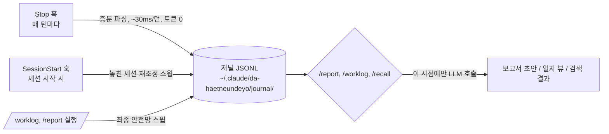

# 다 했는데요? (da-haetneundeyo)

> Turns your Claude Code sessions into weekly/monthly work reports. It captures what you did — files touched, commands run, commits made — as you work (zero extra tokens), then drafts a report only when you ask for one. Journal data stays local under `~/.claude/da-haetneundeyo/`, in plain JSONL you can read, edit, or delete yourself. MIT licensed.

**한 줄 소개**: Claude Code로 진행한 작업을 자동으로 기록해 주간/월간 업무 보고 초안을 만들어 주는 플러그인입니다.

---

## 왜 필요한가

AI(Claude Code)로 대부분의 업무를 진행하면서 개발자는 실행자가 아닌 **검토자**가 되어갑니다. 그 결과 흔히 벌어지는 일:

- 코드 디테일을 예전만큼 기억하지 못한다.
- 주간/월간 보고서에 쓸 내용이 빈약하다 — 실제로는 일을 많이 했는데 정리된 기록이 없다.
- 지난 작업을 확인하려면 대화 기록을 뒤지거나 git log를 헤집어야 한다.

**다 했는데요?**는 평소처럼 Claude Code를 쓰기만 해도 작업 일지가 자동으로 쌓이고, 필요할 때 주간/월간 보고서 초안과 과거 작업 검색이 가능하도록 만드는 것을 목표로 합니다.

## 설치

```
/plugin marketplace add <이 저장소 경로 또는 URL>
/plugin install da-haetneundeyo
```

설치 후 새 Claude Code 세션을 시작하면 온보딩 안내가 나옵니다 (아래 참고).

## 설치 후 첫 사용

### 1. 온보딩 백필 안내

플러그인이 처음 실행되면(`SessionStart` 훅) 최근 48시간 세션은 자동으로 일지에 반영되고, 다음과 같은 안내가 표시됩니다:

```
[da-haetneundeyo] 다 했는데요? 플러그인이 처음 실행되었습니다.
최근 48시간 세션은 작업 일지에 반영했습니다.
사용자에게 다음을 안내하세요: 지난 30일 세션 기록을 일지로 백필하려면
"node ".../scripts/journal-cli.mjs" backfill --days 30" 을 실행하면 되며
(토큰 소모 없음, 수 초 소요), 원하는지 한 번만 물어보세요.
이후 /worklog, /report weekly 를 소개하세요.
```

원하면 승인 한 번으로 지난 30일치 세션이 일지로 편입되어, **설치 당일에도 바로 첫 보고서를 만들 수 있습니다.**

### 2. `/worklog` — 오늘/이번 주 작업 일지 조회

```
/worklog
```

예시 출력:

```
📓 7/3 (금) — 세션 3건 (작업 2 · 질의 1), 커밋 2건
· [demo-api 15:50-15:57] UserController 페이징 버그 수정 → b2c3d4e (kind=work)
· [admin-web 16:10-16:22] 대시보드 차트 컴포넌트 추가 (kind=work) ⏳ 미완료 추정
· [demo-api 17:00-17:05] MyBatis 매핑 질의 (kind=qa — 보고서 제외)
```

모호한 항목은 한 줄 메모를 보완할 수 있습니다:

```
node "${CLAUDE_PLUGIN_ROOT}/scripts/journal-cli.mjs" note --session <ID> --day <YYYY-MM-DD> --text "<메모>"
node "${CLAUDE_PLUGIN_ROOT}/scripts/journal-cli.mjs" kind --session <ID> --day <YYYY-MM-DD> --value <work|qa>
```

### 3. `/report weekly` — 주간 업무 보고서 생성

```
/report weekly
/report weekly --format docx
/report monthly 2026-06
```

일지의 `kind=work` 항목을 프로젝트별로 그룹핑해 실적 문장으로 승격하고, 추정이 섞인 항목에는 `⚠️추정` 마커를 붙입니다. 결과는 `~/.claude/da-haetneundeyo/reports/2026-W27-weekly.md`로 저장됩니다. 예시:

```
## 금주 실적
- 주문 API 백엔드: 사용자 페이징 버그 수정 (b2c3d4e)
- 주문 시스템 프론트엔드: 대시보드 차트 컴포넌트 추가 ⚠️추정

## 차주 계획
- 대시보드 차트 컴포넌트 마무리 (7/3 세션 미완료)

## 특이사항
없음
```

`--format docx`는 회사 양식(.docx)에 값을 채워 넣습니다 — 아래 "회사 양식 등록" 참고. 양식을 등록하지 않았다면 md만 저장하고 `/report setup` 안내가 나옵니다.

### 4. `/recall <질문>` — 과거 작업 검색

```
/recall MyBatis 페이징 어떻게 했지
```

저널을 ripgrep으로 검색해 인덱스(날짜·프로젝트·요약·커밋해시)를 먼저 보여주고, 원할 때만 커밋 상세(`git show --stat`)나 세션 원문을 추가로 불러옵니다. 이어서 작업하려면 `claude --resume <sessionId>`를 안내합니다.

## 회사 양식 등록 — `/report setup`

```
/report setup
```

1. 회사 업무 보고 양식(.docx) 경로를 물어 `~/.claude/da-haetneundeyo/templates/`로 복사합니다.
2. 양식 안의 `{금주실적}` 같은 중괄호 플레이스홀더가 어떤 섹션(`achievements`/`next_plans`/`notes`)에 대응하는지 확인해 `config.json`의 `docxTemplate: { path, fields }`에 저장합니다.
3. 프로젝트 경로 → 업무명 매핑(`projectMap`)도 함께 확인·수정합니다 (예: `demo-api` → "주문 API 백엔드").

## 동작 원리

원칙: **캡처는 결정적(토큰 0), LLM은 조회·보고서 생성 시점에만 호출.** 상주 프로세스 없음.



3중 안전망으로 세션 유실을 방지합니다:

1. **Stop 훅 (주력)** — 매 턴 종료마다 실행되어 세션별 저장된 오프셋 이후의 새 줄만 증분 파싱, 저널에 세션ID 기준 upsert. 터미널을 강제 종료해도 마지막 완료 턴까지는 이미 저널에 반영됩니다.
2. **SessionStart 훅 (재조정)** — 새 세션 시작 시 마지막 스윕 이후 변경된 세션을 다시 스캔해 놓친 기록을 회수. 최초 실행 시 온보딩 백필을 제안합니다.
3. **`/worklog`, `/report` 실행 시 스윕** — 조회·보고서 생성 직전 항상 한 번 더 재조정.

`SessionEnd` 훅은 보너스로 세션 완료 마킹만 수행합니다. upsert는 멱등이라 같은 세션을 여러 번 재처리해도 저널에 중복이 생기지 않습니다.

작업 분류(`kind`)는 자동입니다: 세션 중 수정한 파일과 커밋이 모두 없으면 `qa`(보고서에서 기본 제외), 하나라도 있으면 `work`로 분류됩니다. `/worklog`의 `kind` 명령으로 재분류할 수 있습니다.

## 프라이버시

- 저널은 `~/.claude/da-haetneundeyo/journal/YYYY/MM/YYYY-MM-DD.jsonl`에 저장되며, **세션별 요청 원문(프롬프트 텍스트)을 포함**합니다.
- 이 디렉토리를 git으로 동기화(예: 여러 PC 간 백업)하려면 **반드시 비공개(private) 저장소**를 사용하세요. 공개 저장소에 올리면 업무 내용과 대화 원문이 그대로 노출됩니다.
- 저장 위치는 `~/.claude/da-haetneundeyo/` 전체(저널, 설정, 등록한 양식, 생성된 보고서 포함)이며, **디렉토리를 삭제하면 모든 데이터가 완전히 제거**됩니다. 별도의 삭제 절차는 없습니다.
  ```
  rm -rf ~/.claude/da-haetneundeyo/       # macOS/Linux
  Remove-Item -Recurse -Force "$env:USERPROFILE\.claude\da-haetneundeyo"   # Windows PowerShell
  ```
- 요청 원문에는 2000자를 넘는 붙여넣기나 `(local command` 접두 항목 등 일부 노이즈는 캡처 단계에서 제외되지만, 민감정보 마스킹은 아직 없습니다(확장 포인트). 사내 코드/자격증명이 포함된 대화가 저장될 수 있음을 감안해 주세요.

## 알려진 제약 / Known limitations

- **docx 양식 플레이스홀더는 단일 중괄호(`{금주실적}`) 형식**입니다. 양식 문서 본문에 플레이스홀더 용도가 아닌 **리터럴 중괄호**(`{`, `}`)가 있으면:
  - 짝이 맞지 않으면 내보내기가 **실패**합니다.
  - 짝이 우연히 맞으면 docxtemplater가 이를 태그로 오인해 **내용이 빈칸으로 치환**될 수 있습니다.
  - 회사 양식에서는 중괄호를 플레이스홀더 용도로만 사용하세요.
- docx 내보내기는 매칭되지 않는 플레이스홀더를 오류 없이 **빈 문자열로 치환**합니다. `/report setup`으로 등록한 `fields` 매핑 키가 양식의 `{태그}` 이름과 정확히 일치하는지 확인이 필요합니다.
- 민감정보 자동 마스킹, GitHub/GitLab PR API 연동, Excel/HWP 양식 출력은 MVP 범위 밖입니다.
- 팀 단위 집계·공유 기능은 없습니다(개인 사용 전제).

## 요구사항

- Node.js **≥ 20** (Claude Code 실행 환경이면 이미 충족됩니다)
- Claude Code 최신 버전
- (선택) `ripgrep`(`rg`) — `/recall` 검색에 사용. 미설치 시 검색이 동작하지 않을 수 있습니다.

## 라이선스

MIT — 자세한 내용은 [LICENSE](./LICENSE) 참고.
