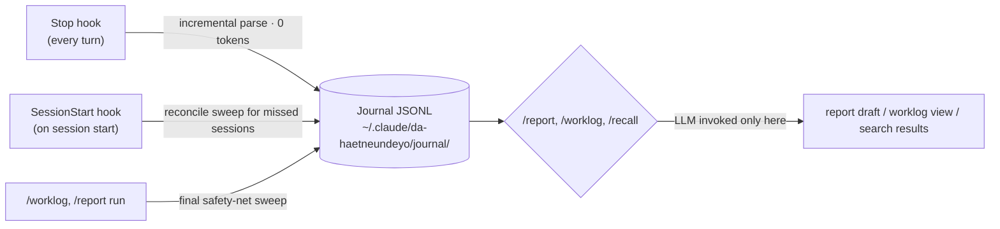

# da-haetneundeyo (다 했는데요?)

> Turns your Claude Code sessions into weekly/monthly work reports. It captures what you did — files touched, commands run, commits made — as you work (zero extra tokens), then drafts a report only when you ask for one. Journal data stays local under `~/.claude/da-haetneundeyo/`, in plain JSONL you can read, edit, or delete yourself. MIT licensed.

**Languages**: English (this file) · [한국어](docs/README.ko.md)

---

## Why

When you run most of your work through AI (Claude Code), you gradually shift from *author* to *reviewer*. Common consequences:

- You remember code details less well than you used to.
- Your weekly/monthly reports feel thin — you actually did a lot, but there's no organized record of it.
- Reviewing past work means digging through conversation history or `git log`.

**da-haetneundeyo** aims to make a work journal accumulate automatically just by using Claude Code as usual, so that weekly/monthly report drafts and past-work search are available whenever you need them.

## Install

```
/plugin marketplace add bangddong/da-haetneundeyo
/plugin install da-haetneundeyo
```

After installing, start a new Claude Code session to see the onboarding notice (below).

## First run

### 1. Onboarding backfill

The first time the plugin runs (`SessionStart` hook), the last 7 days of sessions are swept into the journal automatically, and you'll see a notice like:

```
[da-haetneundeyo] The "da-haetneundeyo" plugin ran for the first time. Recent 7-day sessions were added to your work journal.
Privacy notice: from now on, every session's request text (including raw prompts), edited files, and commit info are stored locally under ~/.claude/da-haetneundeyo.
Nothing is sent externally; deleting the directory removes it completely (see the Privacy section of the README).
```

Before backfill, only the last 7 days are visible — **a 30-day backfill is recommended.** With one approval, the last 30 days of sessions are folded into the journal, so **you can produce your first report on install day.**

```
node "${CLAUDE_PLUGIN_ROOT}/scripts/journal-cli.mjs" backfill --days 30
```

This consumes no tokens and takes up to a minute or two.

> ⚠️ If you install right after a weekend (e.g. on a Monday), the 7-day sweep spans the weekend too, so the journal may look empty if you had few sessions — the 30-day backfill is recommended here as well.

### 2. View today's / this week's journal

```
What did I do today?
What did I do last week?
```

Or: `/worklog`

Example output:

```
📓 7/3 (Fri) — 3 sessions (2 work · 1 q&a), 2 commits
· [demo-api 15:50-15:57] Fixed UserController paging bug → b2c3d4e (kind=work)
· [admin-web 16:10-16:22] Added dashboard chart component (kind=work) ⏳ likely incomplete
· [demo-api 17:00-17:05] MyBatis mapping question (kind=qa — excluded from reports)
```

You can refine ambiguous entries with notes/reclassification in natural language:

```
Add a note "approval-line bug" to the second entry
Reclassify the third entry as work, not q&a
```

(For reference, this runs the following CLI internally)

```
node "${CLAUDE_PLUGIN_ROOT}/scripts/journal-cli.mjs" note --session <ID> --day <YYYY-MM-DD> --text "<note>"
node "${CLAUDE_PLUGIN_ROOT}/scripts/journal-cli.mjs" kind --session <ID> --day <YYYY-MM-DD> --value <work|qa>
```

### 3. Generate a weekly/monthly report

```
Make a weekly report
Make a report for last week
```

Or: `/report weekly`

```
/report weekly
/report weekly --format docx
/report monthly 2026-06
```

It groups `kind=work` journal entries by project, promotes them into achievement sentences, and marks entries that involved guesswork with a `⚠️추정` (estimated) flag. Results are saved to `~/.claude/da-haetneundeyo/reports/2026-W27-weekly.md`. Example:

```
## Achievements
- Order API backend: fixed user paging bug (b2c3d4e)
- Admin web: added dashboard chart component ⚠️추정

## Next-week plan
- Finish the dashboard chart component (incomplete in the 7/3 session)

## Notes
None
```

`--format docx` fills your company template (.docx) with the values — see "Register a company template" below. If you haven't registered a template, it saves only the md and points you to `/report setup`.

> **Model guide**: Journal capture and search indexing run as deterministic code, independent of model quality. Report *sentence generation*, on the other hand, depends on the model — so Sonnet or better is recommended only when running `/report`. That's roughly once a week, so the cost impact is low.

### 4. Search past work

```
How did I fix that SAP timeout?
```

Or: `/recall <question>`

```
/recall how did I do MyBatis paging
```

It searches the journal with ripgrep and shows an index first (date · project · summary · commit hash), then loads commit details (`git show --stat`) or the full session transcript only on request. To continue from a past session, it points you to `claude --resume <sessionId>`.

## Register a company template — `/report setup`

```
/report setup
```

1. Asks for the path to your company report template (.docx) and copies it to `~/.claude/da-haetneundeyo/templates/`.
2. Confirms which section (`achievements` / `next_plans` / `notes`) each curly-brace placeholder like `{금주실적}` in the template maps to, and saves it under `docxTemplate: { path, fields }` in `config.json`.
3. Also confirms/edits the project-path → work-name mapping (`projectMap`) (e.g. `demo-api` → "Order API backend").
4. Confirms the report output location (`reportsDir`). The default is `~/.claude/da-haetneundeyo/reports/`; you can save elsewhere by setting it in `config.json`:

```json
{ "reportsDir": "D:\\work-reports" }
```

> ⚠️ **Caution**: If you point `reportsDir` at a cloud auto-sync folder like OneDrive, the saved reports (which contain work content — achievement sentences, commit summaries, etc.) will be synced as-is. Choose carefully, as this may include content your company policy considers inappropriate for external sync.

## How it works

Principle: **capture is deterministic (0 tokens); the LLM is invoked only at view/report time.** No resident process.



> Note: the Stop-hook incremental parse is a design goal of near-zero latency; actual per-turn delay is dominated by Node startup time on your machine.

A triple safety net prevents session loss:

1. **Stop hook (primary)** — runs at the end of every turn, incrementally parses only the new lines past the stored per-session offset, and upserts into the journal by session ID. Even if you force-quit the terminal, everything up to the last completed turn is already in the journal.
2. **SessionStart hook (reconcile)** — on a new session, re-scans sessions changed since the last sweep to recover anything missed. On first run it offers the onboarding backfill.
3. **Sweep on `/worklog`, `/report`** — one more reconcile pass right before viewing/report generation.

The `SessionEnd` hook is a bonus that only marks session completion. Upserts are idempotent, so reprocessing the same session multiple times never creates duplicates in the journal.

Work classification (`kind`) is automatic: if a session has neither edited files nor commits, it's `qa` (excluded from reports by default); if it has either, it's `work`. You can reclassify with the `kind` command in `/worklog`.

Commit attribution rule: commits linked to a session are those within the session's time window (start–end) **and authored by you** — filtered by the repository's git `user.email`, overridable via the `gitAuthor` value in `config.json`. Merge commits are excluded (`--no-merges`). Entries that still overlap ambiguously in time are flagged `⚠️추정`, so please verify before submitting a report.

Files edited by subagents (work delegated via the Task tool) are also merged into the parent session's `filesEdited` — the subagent's own requests/conversation are treated as noise and not journaled, but the file paths it actually edited must be reflected in the parent session so commit attribution and report achievements aren't missed.

(Optional) Setting `"archive": true` in `config.json` keeps a separate compressed archive of only the user/assistant text of `kind=work` sessions at each sweep, so you can retrieve the original text even after the source transcript is cleaned up — see the FAQ below.

## About permission prompts

- **Hooks (Stop/SessionStart/SessionEnd)** run automatically under your plugin-install consent; they don't raise a separate permission prompt on each run.
- The **Bash/file-writes during the `/worklog`, `/report`, `/recall` skills**, however, go through Claude Code's normal permission checks — being asked to approve journal reads (`journal-cli.mjs`), search (`rg`), commit details (`git show`), etc. is **normal behavior**.
- If approving every time is tedious, add an allow-list to `~/.claude/settings.json`:

```json
{
  "permissions": { "allow": ["Bash(node *da-haetneundeyo*)", "Bash(rg * *da-haetneundeyo*)"] }
}
```

## Privacy

- The journal is stored at `~/.claude/da-haetneundeyo/journal/YYYY/MM/YYYY-MM-DD.jsonl` and **includes the raw request text (prompt text) per session**.
- To sync this directory with git (e.g. to back up across multiple PCs), you **must use a private repository**. Pushing to a public repo exposes your work content and raw conversation.
- Everything lives under `~/.claude/da-haetneundeyo/` (journal, config, registered templates, generated reports), and **deleting the directory removes all data completely**. There's no separate deletion procedure.
  ```
  rm -rf ~/.claude/da-haetneundeyo/       # macOS/Linux
  Remove-Item -Recurse -Force "$env:USERPROFILE\.claude\da-haetneundeyo"   # Windows PowerShell
  ```
- Some noise is excluded at capture time — pastes over 2000 chars, entries prefixed with `(local command`, etc. — but there is **no sensitive-data masking yet** (an extension point). Assume conversations containing internal code/credentials may be stored.
- **If you enable the archive (`archive: true`, off by default)**: per-session compressed files accumulate at `~/.claude/da-haetneundeyo/archive/YYYY/MM/<sessionId>.jsonl.gz`. Unlike the journal, these **include user/assistant text untruncated (no 2000-char cap)**, so they're more sensitive than the journal — that's why it's opt-in. When syncing with git, use a private repo just like the journal, and it's removed together when you delete the whole `~/.claude/da-haetneundeyo/` directory.

## Known limitations

- **docx template placeholders use single curly braces (`{금주실적}`)**. If the template body contains **literal curly braces** (`{`, `}`) not meant as placeholders:
  - Unbalanced braces cause the export to **fail**.
  - Accidentally balanced braces may be mistaken for tags by docxtemplater and **replaced with blanks**.
  - Use curly braces only for placeholders in your company template.
- docx export **replaces unmatched placeholders with empty strings without error**. Verify that the `fields` mapping keys you registered via `/report setup` exactly match the `{tag}` names in the template.
- Automatic sensitive-data masking, GitHub/GitLab PR API integration, and Excel/HWP template output are out of MVP scope.
- There's no team-level aggregation/sharing (personal use is assumed).

### Limits of the record

The journal has **no distortion (everything is a verbatim excerpt), but it does have gaps.** Understand these four before relying on it.

- **(a) The solution process (how/why) is not stored.** The journal keeps only requests, edited files, and commits — not the trial-and-error or reasoning exchanged in conversation. While Claude Code's original session transcript exists (30 days by default) you can recover it from there, but after that only the archive (opt-in, see FAQ) or commit diffs can fill the gap.
- **(b) Context-dependent requests ("that thing from yesterday") are reconstructed by inference at report time.** Domains are inferred from circumstantial evidence like file paths and commits, and such entries always carry a `⚠️추정` flag — always verify before submitting.
- **(c) Requests over 2000 chars keep only the first 300.** If you pasted a long block (full logs, entire code, etc.) into a prompt, the journal keeps only the leading summary with the rest shown as "…(전체 N자 생략)".
- **(d) The following patterns are treated as noise and excluded from the journal entirely**: entries starting with `(local command`, system meta-messages like `<task-notification>` / `<system-reminder>`, interrupt messages starting with `[Request interrupted`, and messages containing only tool results (`tool_result`).

## FAQ

**Q. I can't open an old session's original text.**

Claude Code keeps session transcripts for 30 days by default (the `cleanupPeriodDays` setting) then cleans them up. The journal (request summaries, files, commits) remains, but if you want to see the full original text and 30 days have passed, the source transcript may already be deleted. Respond according to your usage scale:

- **Light users**: extending `cleanupPeriodDays` to e.g. 90 days is harmless. Measured monthly transcript growth for one active user is about 55 MB, so extending retention isn't a big disk burden.
- **Heavy / multi-agent users**: if you have many sessions/volume (e.g. heavy subagent use), enabling the archive option below is recommended over extending retention — it stores only user/assistant text compressed, so it's far smaller.

To enable the archive, add this to `~/.claude/da-haetneundeyo/config.json`:

```json
{ "archive": true }
```

From then on, at each sweep (next session start or when `/worklog`, `/report` runs), `kind=work` sessions are archived to `~/.claude/da-haetneundeyo/archive/YYYY/MM/<sessionId>.jsonl.gz`. Even after the source transcript is gone, you can retrieve it with `journal-cli.mjs archive-read --session <ID> --day <YYYY-MM-DD>` (the `/recall` skill tries this fallback automatically).

**Q. I want to move the whole journal/config/reports location.**

Set the `DHND_DATA_DIR` environment variable to move all of `~/.claude/da-haetneundeyo/` (journal, config, archive, default report location) to a path of your choice — to move only reports, use the `reportsDir` setting from "Register a company template" above.

## Requirements

- Node.js **≥ 20** (already satisfied if you're running Claude Code)
- A recent version of Claude Code
- (Optional) `ripgrep` (`rg`) — used for `/recall` search. Search may not work if it's not installed.

## License

MIT — see [LICENSE](./LICENSE) for details.
