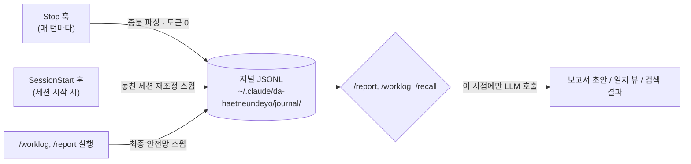

# 다 했는데요? (da-haetneundeyo)

> Claude Code로 진행한 작업을 자동으로 기록해 주간/월간 업무 보고 초안을 만들어 주는 플러그인입니다. 작업하는 동안(추가 토큰 0) 수정한 파일·실행한 명령·생성한 커밋을 캡처하고, 보고서는 요청할 때만 생성합니다. 저널 데이터는 `~/.claude/da-haetneundeyo/` 아래에 직접 읽고·수정·삭제할 수 있는 평문 JSONL로 로컬 보관됩니다. MIT 라이선스.

**언어**: [English](../README.md) · 한국어(이 문서)

---

## 왜 필요한가

AI(Claude Code)로 대부분의 업무를 진행하면서 개발자는 실행자가 아닌 **검토자**가 되어갑니다. 그 결과 흔히 벌어지는 일:

- 코드 디테일을 예전만큼 기억하지 못한다.
- 주간/월간 보고서에 쓸 내용이 빈약하다 — 실제로는 일을 많이 했는데 정리된 기록이 없다.
- 지난 작업을 확인하려면 대화 기록을 뒤지거나 git log를 헤집어야 한다.

**다 했는데요?**는 평소처럼 Claude Code를 쓰기만 해도 작업 일지가 자동으로 쌓이고, 필요할 때 주간/월간 보고서 초안과 과거 작업 검색이 가능하도록 만드는 것을 목표로 합니다.

## 설치

```
/plugin marketplace add bangddong/da-haetneundeyo
/plugin install da-haetneundeyo
```

설치 후 새 Claude Code 세션을 시작하면 온보딩 안내가 나옵니다 (아래 참고).

## 설치 후 첫 사용

### 1. 온보딩 백필 안내

플러그인이 처음 실행되면(`SessionStart` 훅) 최근 7일 세션은 자동으로 일지에 반영되고, 다음과 같은 안내가 표시됩니다:

```
[da-haetneundeyo] "다 했는데요?" 플러그인이 처음 실행되었습니다. 최근 7일 세션을 작업 일지에 반영했습니다.
프라이버시 고지: 이후 모든 세션의 요청 내용(원문 프롬프트 포함)·수정 파일·커밋 정보가 ~/.claude/da-haetneundeyo 에 로컬 저장됩니다.
외부 전송은 없으며, 디렉토리 삭제로 완전 제거됩니다 (README 프라이버시 섹션 참고).
사용자에게 다음을 안내하세요: 백필 전에는 일지와 보고서가 최근 7일만 커버합니다. 지난 30일을 반영하려면
"node ".../scripts/journal-cli.mjs" backfill --days 30" 실행 (토큰 소모 없음, 최대 1-2분).
원하는지 한 번만 물어보고, 이후 "오늘 뭐 했지?", "주간보고 만들어줘" 같은 자연어 사용법을 소개하세요.
```

백필 전에는 최근 7일만 보입니다 — **지난 30일 백필을 권장합니다.** 원하면 승인 한 번으로 지난 30일치 세션이 일지로 편입되어, **설치 당일에도 바로 첫 보고서를 만들 수 있습니다.**

> ⚠️ 주말 직후(월요일 등)에 설치하면 7일 스윕도 주말을 포함하므로, 세션이 거의 없던 경우 일지가 비어 보일 수 있습니다 — 이럴 때도 30일 백필을 권장합니다.

### 2. 오늘/이번 주 작업 일지 조회

```
오늘 뭐 했지?
지난주에 뭐 했지?
```

이렇게도 가능: `/worklog`

예시 출력:

```
📓 7/3 (금) — 세션 3건 (작업 2 · 질의 1), 커밋 2건
· [demo-api 15:50-15:57] UserController 페이징 버그 수정 → b2c3d4e (kind=work)
· [admin-web 16:10-16:22] 대시보드 차트 컴포넌트 추가 (kind=work) ⏳ 미완료 추정
· [demo-api 17:00-17:05] MyBatis 매핑 질의 (kind=qa — 보고서 제외)
```

모호한 항목은 자연어로 메모·분류를 보완할 수 있습니다:

```
두 번째 항목에 "결재선 버그 건"이라고 메모 달아줘
세 번째 항목은 질의가 아니라 작업으로 재분류해줘
```

(참고: 내부적으로는 아래 CLI를 실행합니다)

```
node "${CLAUDE_PLUGIN_ROOT}/scripts/journal-cli.mjs" note --session <ID> --day <YYYY-MM-DD> --text "<메모>"
node "${CLAUDE_PLUGIN_ROOT}/scripts/journal-cli.mjs" kind --session <ID> --day <YYYY-MM-DD> --value <work|qa>
```

### 3. 주간/월간 업무 보고서 생성

```
주간보고 만들어줘
지난주 주간보고 만들어줘
```

이렇게도 가능: `/report weekly`

```
/report weekly
/report weekly --format docx
/report monthly 2026-06
```

일지의 `kind=work` 항목을 프로젝트별로 그룹핑해 실적 문장으로 승격하고, 추정이 섞인 항목에는 `⚠️추정` 마커를 붙입니다. 결과는 `~/.claude/da-haetneundeyo/reports/2026-W27-weekly.md`로 저장됩니다. 예시:

```
## 금주 실적
- 주문 API 백엔드: 사용자 페이징 버그 수정 (b2c3d4e)
- 관리자 웹: 대시보드 차트 컴포넌트 추가 ⚠️추정

## 차주 계획
- 대시보드 차트 컴포넌트 마무리 (7/3 세션 미완료)

## 특이사항
없음
```

`--format docx`는 회사 양식(.docx)에 값을 채워 넣습니다 — 아래 "회사 양식 등록" 참고. 양식을 등록하지 않았다면 md만 저장하고 `/report setup` 안내가 나옵니다.

> **모델 가이드**: 일지 기록·검색 인덱싱은 결정적 코드로 동작해 모델 성능과 무관합니다. 반면 보고서 문장 생성 품질은 모델 영향을 받으므로, `/report`(주간/월간보고) 실행 시에만 Sonnet 이상 모델을 권장합니다 — 주 1회 정도라 비용 부담은 낮습니다.

### 4. 과거 작업 검색

```
그때 SAP 타임아웃 어떻게 고쳤지?
```

이렇게도 가능: `/recall <질문>`

```
/recall MyBatis 페이징 어떻게 했지
```

저널을 ripgrep으로 검색해 인덱스(날짜·프로젝트·요약·커밋해시)를 먼저 보여주고, 원할 때만 커밋 상세(`git show --stat`)나 세션 원문을 추가로 불러옵니다. 이어서 작업하려면 `claude --resume <sessionId>`를 안내합니다.

## 회사 양식 등록 — `/report setup`

```
/report setup
```

1. 회사 업무 보고 양식(.docx) 경로를 물어 `~/.claude/da-haetneundeyo/templates/`로 복사합니다.
2. 양식 안의 `{금주실적}` 같은 중괄호 플레이스홀더가 어떤 섹션(`achievements`/`next_plans`/`notes`)에 대응하는지 확인해 `config.json`의 `docxTemplate: { path, fields }`에 저장합니다.
3. 프로젝트 경로 → 업무명 매핑(`projectMap`)도 함께 확인·수정합니다 (예: `demo-api` → "주문 API 백엔드").
4. 보고서 저장 위치(`reportsDir`)도 확인합니다. 기본값은 `~/.claude/da-haetneundeyo/reports/`이며, `config.json`에 다음과 같이 지정하면 다른 위치에 저장할 수 있습니다:

```json
{ "reportsDir": "D:\\work-reports" }
```

> ⚠️ **주의**: `reportsDir`을 OneDrive 등 클라우드 자동 동기화 폴더로 지정하면, 저장되는 보고서(실적 문장·커밋 요약 등 업무 내용 포함)가 그대로 동기화됩니다. 회사 정책상 외부 동기화가 부적절한 내용이 포함될 수 있으니 신중히 선택하세요.

## 동작 원리

원칙: **캡처는 결정적(토큰 0), LLM은 조회·보고서 생성 시점에만 호출.** 상주 프로세스 없음.



> 참고: Stop 훅의 증분 파싱은 지연 최소화를 설계 목표로 하지만, 실제 턴당 지연은 사용자 머신의 Node 기동 시간에 좌우됩니다.

3중 안전망으로 세션 유실을 방지합니다:

1. **Stop 훅 (주력)** — 매 턴 종료마다 실행되어 세션별 저장된 오프셋 이후의 새 줄만 증분 파싱, 저널에 세션ID 기준 upsert. 터미널을 강제 종료해도 마지막 완료 턴까지는 이미 저널에 반영됩니다.
2. **SessionStart 훅 (재조정)** — 새 세션 시작 시 마지막 스윕 이후 변경된 세션을 다시 스캔해 놓친 기록을 회수. 최초 실행 시 온보딩 백필을 제안합니다.
3. **`/worklog`, `/report` 실행 시 스윕** — 조회·보고서 생성 직전 항상 한 번 더 재조정.

`SessionEnd` 훅은 보너스로 세션 완료 마킹만 수행합니다. upsert는 멱등이라 같은 세션을 여러 번 재처리해도 저널에 중복이 생기지 않습니다.

작업 분류(`kind`)는 자동입니다: 세션 중 수정한 파일과 커밋이 모두 없으면 `qa`(보고서에서 기본 제외), 하나라도 있으면 `work`로 분류됩니다. `/worklog`의 `kind` 명령으로 재분류할 수 있습니다. 각 세션에는 지속시간 기반 `archetype`(quick <15분 / standard <2시간 / deep <6시간 / marathon)도 붙습니다 — 예를 들어 marathon인데 커밋이 없는 세션은 대형 진행 중 작업으로 판단해 차주 계획 최상단에 올립니다.

날짜는 **로컬 기준**입니다: 일지 조회("오늘 뭐 했지")와 보고서 기간은 머신의 로컬 자정을 경계로 하므로, 새벽 1시에 시작한 세션도 (UTC 기준 어제가 아니라) 오늘로 잡힙니다.

커밋 귀속 규칙: 세션에 연결되는 커밋은 세션 시간 창(시작~종료) 안에 있으면서, **본인이 작성한 커밋만** 포함합니다 — 저장소의 git `user.email` 기준으로 필터링하며, `config.json`의 `gitAuthor` 값이 있으면 그 값으로 override합니다. 머지 커밋은 제외됩니다(`--no-merges`). 각 커밋에는 날짜와 변경 규모(파일 수·추가/삭제 라인, `--shortstat`)가 함께 저장되어 보고서의 정량 근거로 쓰입니다. 그래도 시간상 겹쳐 애매하게 섞이는 항목은 `⚠️추정` 플래그로 표시되니, 보고서 제출 전 확인해 주세요.

서브에이전트(Task 도구로 위임한 작업)가 수정한 파일도 부모 세션의 `filesEdited`에 병합됩니다 — 서브에이전트 자체의 요청·대화 내용은 노이즈로 간주해 저널에 남기지 않지만, 실제로 수정한 파일 경로는 부모 세션 실적에 반영되어야 커밋 귀속과 보고서 실적이 누락되지 않습니다.

(선택) `config.json`에 `"archive": true`를 설정하면, 스윕 시점마다 `kind=work` 세션의 user/assistant 텍스트만 압축 아카이브로 별도 보관해 원본 transcript 정리 이후에도 원문을 조회할 수 있습니다 — 자세한 내용은 아래 FAQ 참고.

## 권한 프롬프트에 관하여

- **훅(Stop/SessionStart/SessionEnd)**은 플러그인 설치 동의로 자동 실행되며, 실행마다 별도 권한 프롬프트가 뜨지 않습니다.
- 반면 `/worklog`, `/report`, `/recall` **스킬 실행 중의 Bash·파일 쓰기**는 Claude Code의 일반 권한 검사를 그대로 받습니다 — 저널 조회(`journal-cli.mjs`), 검색(`rg`), 커밋 상세 조회(`git show`) 등을 실행할 때마다 승인을 요청받는 것은 **정상 동작**입니다.
- 매번 승인하기가 번거롭다면 `~/.claude/settings.json`에 다음과 같이 허용 목록을 추가하세요:

```json
{
  "permissions": { "allow": ["Bash(node *da-haetneundeyo*)", "Bash(rg * *da-haetneundeyo*)"] }
}
```

## 프라이버시

- 저널은 `~/.claude/da-haetneundeyo/journal/YYYY/MM/YYYY-MM-DD.jsonl`에 저장되며, **세션별 요청 원문(프롬프트 텍스트)을 포함**합니다.
- 이 디렉토리를 git으로 동기화(예: 여러 PC 간 백업)하려면 **반드시 비공개(private) 저장소**를 사용하세요. 공개 저장소에 올리면 업무 내용과 대화 원문이 그대로 노출됩니다.
- 저장 위치는 `~/.claude/da-haetneundeyo/` 전체(저널, 설정, 등록한 양식, 생성된 보고서 포함)이며, **디렉토리를 삭제하면 모든 데이터가 완전히 제거**됩니다. 별도의 삭제 절차는 없습니다.
  ```
  rm -rf ~/.claude/da-haetneundeyo/       # macOS/Linux
  Remove-Item -Recurse -Force "$env:USERPROFILE\.claude\da-haetneundeyo"   # Windows PowerShell
  ```
- 요청 원문에는 2000자를 넘는 붙여넣기나 `(local command` 접두 항목 등 일부 노이즈는 캡처 단계에서 제외되지만, 민감정보 마스킹은 아직 없습니다(확장 포인트). 사내 코드/자격증명이 포함된 대화가 저장될 수 있음을 감안해 주세요.
- **아카이브(`archive: true`, 기본값 off)를 켠 경우**: `~/.claude/da-haetneundeyo/archive/YYYY/MM/<sessionId>.jsonl.gz`에 세션별 압축 파일이 추가로 쌓입니다. 저널과 달리 **user/assistant 원문 텍스트를 절단 없이(2000자 제한 미적용) 포함**하므로, 저널보다 민감도가 높습니다 — opt-in인 이유이며, git 동기화 시 저널과 동일하게 반드시 비공개 저장소를 사용하고 삭제 시에도 `~/.claude/da-haetneundeyo/` 전체 삭제에 함께 포함됩니다.

## 알려진 제약

- **docx 양식 플레이스홀더는 단일 중괄호(`{금주실적}`) 형식**입니다. 양식 문서 본문에 플레이스홀더 용도가 아닌 **리터럴 중괄호**(`{`, `}`)가 있으면:
  - 짝이 맞지 않으면 내보내기가 **실패**합니다.
  - 짝이 우연히 맞으면 docxtemplater가 이를 태그로 오인해 **내용이 빈칸으로 치환**될 수 있습니다.
  - 회사 양식에서는 중괄호를 플레이스홀더 용도로만 사용하세요.
- docx 내보내기는 매칭되지 않는 플레이스홀더를 오류 없이 **빈 문자열로 치환**합니다. `/report setup`으로 등록한 `fields` 매핑 키가 양식의 `{태그}` 이름과 정확히 일치하는지 확인이 필요합니다.
- GitHub PR 연동은 opt-in으로 지원됩니다 (`config.json`에 `"prOutcomes": true`, 인증된 `gh` CLI 필요) — 머지된 PR 번호가 보고서 실적에 병기됩니다. GitLab 등 다른 플랫폼은 범위 밖입니다.
- 민감정보 자동 마스킹, Excel/HWP 양식 출력은 MVP 범위 밖입니다.
- 팀 단위 집계·공유 기능은 없습니다(개인 사용 전제).

### 기록의 한계

저널은 **왜곡은 없지만(모두 원문 발췌), 누락은 있습니다.** 아래 네 가지를 이해하고 쓰세요.

- **(a) 해결 과정(어떻게·왜)은 저장되지 않습니다.** 저널에는 요청·수정 파일·커밋만 남고, 대화로 오간
  시행착오나 판단 근거는 남지 않습니다. Claude Code의 원본 세션 transcript가 있는 동안(기본 30일)은
  거기서 복원할 수 있지만, 그 이후에는 아카이브(opt-in, 아래 FAQ 참고)나 커밋 diff로만 보완됩니다.
- **(b) 맥락 의존 요청("어제 그거")은 보고서 생성 시점에 추정으로 복원됩니다.** 파일 경로·커밋 등
  정황 증거로 도메인을 추정해 문장을 만들며, 이런 항목에는 항상 `⚠️추정` 플래그가 붙습니다 — 제출 전
  반드시 확인하세요.
- **(c) 2000자를 넘는 요청은 앞 300자만 보존됩니다.** 긴 붙여넣기(로그, 코드 전체 등)를 그대로 프롬프트에
  넣은 경우, 저널에는 앞부분 요약만 남고 나머지는 "…(전체 N자 생략)"으로 표시됩니다.
- **(d) 다음 패턴은 노이즈로 간주되어 저널에서 완전히 제외됩니다**: `(local command`로 시작하는 항목,
  `<task-notification>`/`<system-reminder>` 등 시스템 메타 메시지, `[Request interrupted`로 시작하는
  중단 메시지, 그리고 도구 실행 결과(tool_result)만 있는 메시지.

## FAQ

**Q. 옛날 세션 원문이 안 열려요.**

Claude Code는 세션 transcript를 기본 30일(`cleanupPeriodDays` 설정) 보관 후 정리합니다. 저널(요청 요약·
파일·커밋)은 그대로 남지만, 원문 전체를 다시 보고 싶을 때 30일이 지났다면 원본 transcript가 이미
삭제되었을 수 있습니다. 사용 규모에 따라 다르게 대응하세요:

- **가벼운 사용자**: `cleanupPeriodDays`를 90일 등으로 늘려도 무해합니다. 실측 기준 활성 사용자 한 명의
  월간 transcript 증가량은 약 55MB 수준이라, 보존 기간을 늘려도 디스크 부담이 크지 않습니다.
- **헤비/멀티에이전트 사용자**: 서브에이전트를 많이 쓰는 등 세션 수·용량이 큰 경우, 보존 기간을 늘리기보다
  아래 아카이브 옵션을 켜는 것을 권장합니다 — 원본 전체가 아니라 user/assistant 텍스트만 압축 보관하므로
  용량이 훨씬 작습니다.

아카이브를 켜려면 `~/.claude/da-haetneundeyo/config.json`에 다음을 추가하세요:

```json
{ "archive": true }
```

이후 스윕 시점(다음 세션 시작 또는 `/worklog`, `/report` 실행 시)마다 `kind=work`인 세션이
`~/.claude/da-haetneundeyo/archive/YYYY/MM/<sessionId>.jsonl.gz`로 압축 보관됩니다. 원본 transcript가
사라진 뒤에도 `journal-cli.mjs archive-read --session <ID> --day <YYYY-MM-DD>`로 다시 불러올 수 있습니다
(`/recall` 스킬이 이 폴백을 자동으로 시도합니다).

**Q. 저널·설정·보고서 저장 위치를 통째로 옮기고 싶어요.**

환경변수 `DHND_DATA_DIR`을 지정하면 `~/.claude/da-haetneundeyo/` 전체(저널, 설정, 아카이브, 보고서 기본 위치)를 원하는 경로로 옮길 수 있습니다 — 보고서만 별도로 옮기려면 위 "회사 양식 등록"의 `reportsDir` 설정을 사용하세요.

## 요구사항

- Node.js **≥ 20** (Claude Code 실행 환경이면 이미 충족됩니다)
- Claude Code 최신 버전
- (선택) `ripgrep`(`rg`) — `/recall` 검색에 사용. 미설치 시 검색이 동작하지 않을 수 있습니다.

## 라이선스

MIT — 자세한 내용은 [LICENSE](../LICENSE) 참고.
